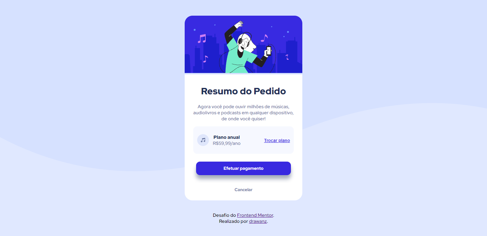

## Frontend Mentor - Desafio "Resumo do Pedido"

Solução proposta para o desafio [Order summary card challenge on Frontend Mentor](https://www.frontendmentor.io/challenges/order-summary-component-QlPmajDUj). Os desagios do Frontend Mentor ajudam no desenvolvimento da nossa capacidade de programar através da construção de projetos realísticos.

## Conteúdos

- [Visão geral](#visao-geral)
  - [O desafio](#the-challenge)
  - [Screenshot](#screenshot)
- [Meu processo](#meu-processo)
  - [Feito com](#feito-com)
  - [O que aprendi](#o-que-aprendi)
- [Sobre mim](#sobre-mim)

## Visão geral

### O desafio

O desafio propõe que seja desenvolvida uma tela conforme a apresentada pelo Frontend Mentor. As imagens foram disponibilizadas, mas não-assinantes não possuem acesso ao arquivo Figma/AdobeXD. Sendo assim, o código desenvolvido foi baseado apenas em um screenshot. Trata-se de um "Order Summary Component", que pode também ser compreendido como a etapa final da compra, ou seja, o resumo da compra realizada até o momento.

### Screenshot

## Meu processo

### Feito com

- HTML5
- CSS3

### O que aprendi

Esse é o primeiro desafio que faço sem estar acompanhar algum curso ou tutorial. A primeira lição é a de que, por mais que os cursos sejam muito importantes para o aprendizado, a prática é completamente diferente. Chega a ser paralisante no início, pois não se sabe por onde começar. Por isso, foi muito importante lidar com a frustração inicial e iniciar pelo mais simples, pela semântica do HTML.

Depois, iniciado o CSS, separei os conteúdos em compartimentos. Isso ajudou tanto na estruturação do conteúdo quanto na sensação de estar perto de concluir e atingir o objetivo proposto pelo desafio.

Mas o maior aprendizado, de fato, é reconhecer minhas fragilidades atuais. Percebi que preciso aprofundar meu estudo sobre as questões de acessibilidade no HTML, por exemplo. No CSS, a maior dificuldade foi estruturar o conteúdo. Sendo assim, preciso estudar sobre as propriedades Float e Display, além de tudo que abrange Flexbox e Responsividade.

## Sobre mim

Estudante do 1º semestre do curso de Bacharelado em Engenharia de Software.
Interesse em: HTML, CSS e Python.
